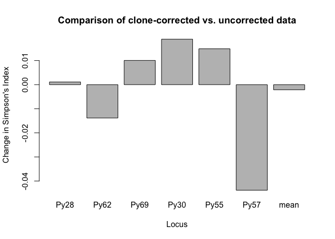
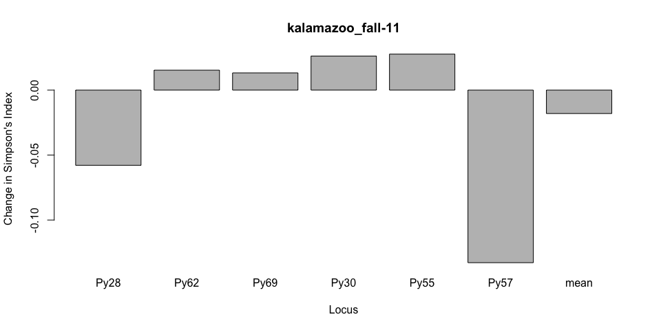
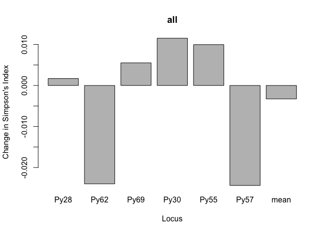
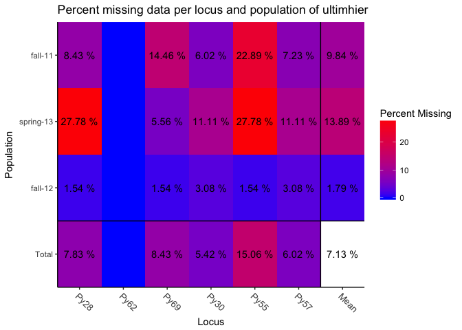
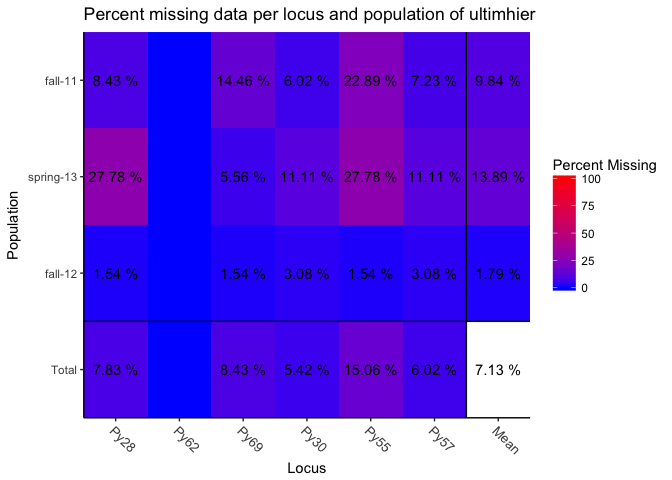

# Clone correction


##Clone correction

```r
#Clone correction
mcc_TY <- clonecorrect(ultimhier, strata = ~County/Season, keep = c(1,2))
mcc_TY
```

```
## 
## This is a genclone object
## -------------------------
## Genotype information:
## 
##    65 original multilocus genotypes 
##    79 diploid individuals
##     6 codominant loci
## 
## Population information:
## 
##     2 strata - County, Season
##     6 populations defined - 
## kalamazoo_fall-11, kent_fall-11, wayne_spring-13, kalamazoo_spring-13, wayne_fall-12, kalamazoo_fall-12
```

```r
#Locus table before and after clone correction
setPop(ultimhier) <- ~County/Season
cc <- locus_table(mcc_TY, info = FALSE)
mp <- locus_table(ultimhier, info = FALSE)

#Locus Differences after clone correction
locus_diff <- mp - cc
barplot(locus_diff[, "1-D"], ylab = "Change in Simpson's Index", xlab = "Locus",
        main = "Comparison of clone-corrected vs. uncorrected data")
```

<!-- -->


Clone correction by population
------------------------------


```r
plot_simp_diff <- function(pop_name, clone_corrected, un_corrected){
  # Step 1: calculate diversity for clone-corrected data
  cc <- locus_table(clone_corrected, pop = pop_name, info = FALSE)
  # Step 2: calculate diversity for uncorrected data
  uc <- locus_table(un_corrected, pop = pop_name, info = FALSE)
  # Step 3: Take the difference
  res <- uc - cc
  # Step 4: Plot Simpson's index.
  barplot(res[, "1-D"], main = pop_name, ylab = "Change in Simpson's Index", xlab = "Locus")
}

par(mfrow = c(2, 3)) # Set up the graphics to have two rows and three columns

for (i in popNames(ultimhier)){
  plot_simp_diff(i, mcc_TY, ultimhier)
}
```

<!-- -->

Clone correction by season
--------------------------


```r
#clone correction by season
mcc_TS <- clonecorrect(ultimhier, strata = ~Season, keep = 1:1)
mcc_TS
```

```
## 
## This is a genclone object
## -------------------------
## Genotype information:
## 
##    65 original multilocus genotypes 
##    76 diploid individuals
##     6 codominant loci
## 
## Population information:
## 
##     2 strata - County, Season
##     3 populations defined - fall-11, spring-13, fall-12
```

```r
#Compare before and after correction
#First Setting uncorrected pop to season
setPop(ultimhier) <- ~Season
plot_simp_diff("all",mcc_TS,ultimhier)
```

<!-- -->

Missing data
-------------

```r
#Missing data looking at Season
setPop(ultimhier)<- ~Season 

#ultimhier
info_table(ultimhier, plot = TRUE)
```

<!-- -->

```
##            Locus
## Population   Py28 Py62  Py69  Py30  Py55  Py57  Mean
##   fall-11   0.084    . 0.145 0.060 0.229 0.072 0.098
##   spring-13 0.278    . 0.056 0.111 0.278 0.111 0.139
##   fall-12   0.015    . 0.015 0.031 0.015 0.031 0.018
##   Total     0.078    . 0.084 0.054 0.151 0.060 0.071
```

```r
#Genotype diversity for the hierarchy by season
poppr(ultimhier)
```

```
##         Pop   N MLG eMLG   SE    H    G lambda   E.5  Hexp   Ia rbarD
## 1   fall-11  83  40 12.2 1.75 3.09 11.3  0.912 0.489 0.529 1.26 0.286
## 2 spring-13  18  14 14.0 0.00 2.58 12.5  0.920 0.937 0.497 1.32 0.280
## 3   fall-12  65  22 11.1 1.48 2.71 10.5  0.905 0.680 0.511 1.25 0.260
## 4     Total 166  65 13.8 1.66 3.63 21.6  0.954 0.561 0.550 1.19 0.256
##        File
## 1 ultimhier
## 2 ultimhier
## 3 ultimhier
## 4 ultimhier
```

```r
#Plotting missing data
miss <- info_table(ultimhier, plot = TRUE, scale = FALSE)
```

<!-- -->

All loci, but Py62 have missing data. 


```r
#Missing data and removing loci
#Removes 5 loci
nanloc <- missingno(ultimhier, "loci")
```

```
## 
## Found 313 missing values.
## 
## 5 loci contained missing values greater than 5%
## 
## Removing 5 loci: Py28, Py69, Py30, Py55, Py57
```

```r
#removing individuals
#Removes 45 individuals using default threshold 5%
nanind <- missingno(ultimhier, "geno")
```

```
## 
## Found 313 missing values.
## 
## 42 genotypes contained missing values greater than 5%
## 
## Removing 42 genotypes: 1.2 A, 1.3 A, 1.3 B, 1.9 A, 1.22 C, 1.44 A,
## 1.49 C, 1.55 A, 1.56 A, 1.58 B, 1.58 C, 1.59 A, 1.61 C, 2.4 B, 2.5
## A , 2.5 C, 2.8 C, 2.14 A , 2.14 C, 2.17 A, 2.30 A, 2.30 B, 2.33 A
## , 2.45 A, 2.45 C, 2.54 C, 4.21 B, 12.3C, 15.1A, 16.3 C, 19.5B,
## 19.50B, 23.5B, 29.10A, 30.11C, 30.16A, 30.18B, 40.19B, 41.6C,
## 41.7B, 42.27B, 42.27C
```

```r
#remove individuals with 2 missing loci
#Removes 15 individuals with 2 missing loci (2/nLoc) (33%)
nanind <- missingno(ultimhier, "geno", cutoff = 2/nLoc(ultimhier))
```

```
## 
## Found 313 missing values.
## 
## 15 genotypes contained missing values greater than 33.3333333333333%
## 
## Removing 15 genotypes: 1.2 A, 1.3 B, 1.9 A, 1.55 A, 1.58 B, 1.58
## C, 1.59 A, 1.61 C, 2.14 C, 2.17 A, 2.30 A, 2.45 A, 19.5B, 30.18B,
## 42.27C
```


```r
#Replacing missing data here I can see NA for missing
nan1 <- popsub(ultimhier, 1, drop = TRUE)
nan1[loc = "L1"]@tab
nan1 <- popsub(ultimhier, 2, drop = TRUE)
nan1[loc = "L1"]@tab
nan1 <- popsub(ultimhier, 2, drop = TRUE)
nan1[loc = "L5"]@tab
nan1 <- popsub(ultimhier, 4, drop = TRUE)
nan1[loc = "L1"]@tab
```

