##Clone correction analysis

```r
#Clone correction
mcc_TY <- clonecorrect(ultimhier, strata = ~County/Season, keep = c(1,2))
mcc_TY
```

```
## 
## This is a genclone object
## -------------------------
## Genotype information:
## 
##    65 original multilocus genotypes 
##    79 diploid individuals
##     6 codominant loci
## 
## Population information:
## 
##     2 strata - County, Season
##     6 populations defined - 
## kalamazoo_fall-11, kent_fall-11, wayne_spring-13, kalamazoo_spring-13, wayne_fall-12, kalamazoo_fall-12
```

```r
#Locus table before and after clone correction
setPop(ultimhier) <- ~County/Season
cc <- locus_table(mcc_TY, info = FALSE)
mp <- locus_table(ultimhier, info = FALSE)

#Locus Differences after clone correction
locus_diff <- mp - cc
barplot(locus_diff[, "1-D"], ylab = "Change in Simpson's Index", xlab = "Locus",
        main = "Comparison of clone-corrected vs. uncorrected data")
```

<!-- -->


Clone correction by population
------------------------------


```r
plot_simp_diff <- function(pop_name, clone_corrected, un_corrected){
  # Step 1: calculate diversity for clone-corrected data
  cc <- locus_table(clone_corrected, pop = pop_name, info = FALSE)
  # Step 2: calculate diversity for uncorrected data
  uc <- locus_table(un_corrected, pop = pop_name, info = FALSE)
  # Step 3: Take the difference
  res <- uc - cc
  # Step 4: Plot Simpson's index.
  barplot(res[, "1-D"], main = pop_name, ylab = "Change in Simpson's Index", xlab = "Locus")
}

#par(mfrow = c(2, 3)) # Set up the graphics to have two rows and three columns

for (i in popNames(ultimhier)){
  plot_simp_diff(i, mcc_TY, ultimhier)
}
```

<!-- -->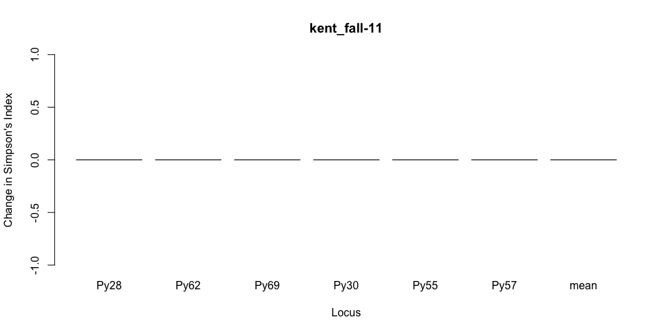<!-- -->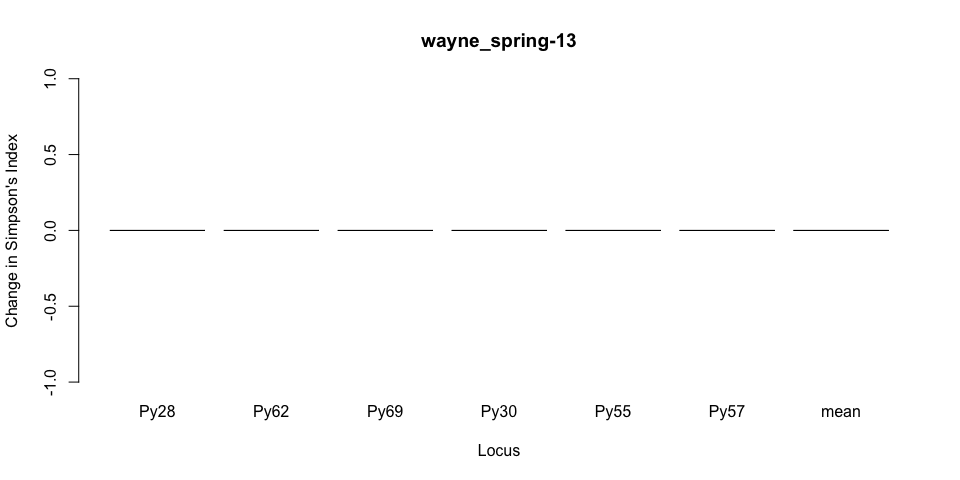<!-- --><!-- -->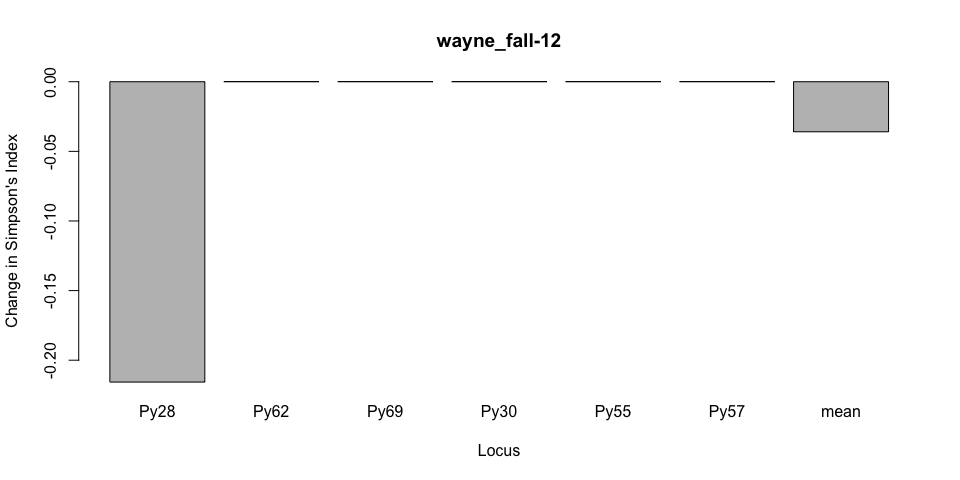<!-- -->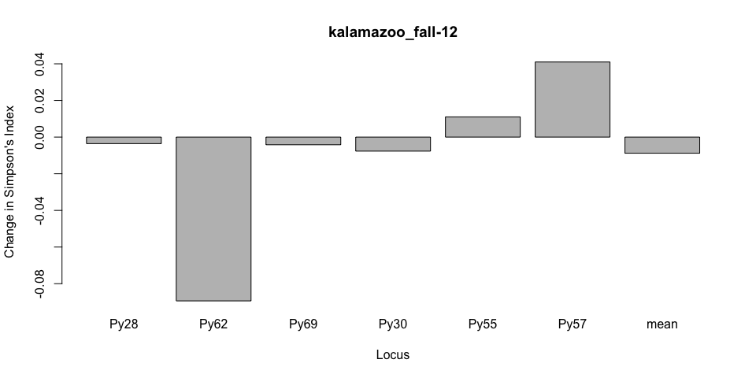<!-- -->

Clone correction by season
--------------------------


```r
#clone correction by season
mcc_TS <- clonecorrect(ultimhier, strata = ~Season, keep = 1:1)
mcc_TS
```

```
## 
## This is a genclone object
## -------------------------
## Genotype information:
## 
##    65 original multilocus genotypes 
##    76 diploid individuals
##     6 codominant loci
## 
## Population information:
## 
##     2 strata - County, Season
##     3 populations defined - fall-11, spring-13, fall-12
```

```r
#Compare before and after correction
#First Setting uncorrected pop to season
setPop(ultimhier) <- ~Season
plot_simp_diff("all",mcc_TS,ultimhier)
```

<!-- -->

Missing data
-------------

```r
#Missing data looking at Season
setPop(ultimhier)<- ~Season 

#ultimhier
info_table(ultimhier, plot = TRUE)
```

<!-- -->

```
##            Locus
## Population   Py28 Py62  Py69  Py30  Py55  Py57  Mean
##   fall-11   0.084    . 0.145 0.060 0.229 0.072 0.098
##   spring-13 0.278    . 0.056 0.111 0.278 0.111 0.139
##   fall-12   0.015    . 0.015 0.031 0.015 0.031 0.018
##   Total     0.078    . 0.084 0.054 0.151 0.060 0.071
```

```r
#Genotype diversity for the hierarchy by season
poppr(ultimhier)
```

```
##         Pop   N MLG eMLG   SE    H    G lambda   E.5  Hexp   Ia rbarD
## 1   fall-11  83  40 12.2 1.75 3.09 11.3  0.912 0.489 0.529 1.26 0.286
## 2 spring-13  18  14 14.0 0.00 2.58 12.5  0.920 0.937 0.497 1.32 0.280
## 3   fall-12  65  22 11.1 1.48 2.71 10.5  0.905 0.680 0.511 1.25 0.260
## 4     Total 166  65 13.8 1.66 3.63 21.6  0.954 0.561 0.550 1.19 0.256
##        File
## 1 ultimhier
## 2 ultimhier
## 3 ultimhier
## 4 ultimhier
```

```r
#Plotting missing data
miss <- info_table(ultimhier, plot = TRUE, scale = FALSE)
```

<!-- -->

All loci, but Py62 have missing data. There are different options to follow, remove 
loci with missing data or removing by genotype.  The first one is not possible since 
it will remove 5 out of 6 loci included in this study.  However removing by genotype 
is more likely, and it will only consider genotypes with alleles.


```r
#Missing data and removing loci
#Removes 5 loci
nanloc <- missingno(ultimhier, "loci")
```

```
## 
## Found 313 missing values.
## 
## 5 loci contained missing values greater than 5%
## 
## Removing 5 loci: Py28, Py69, Py30, Py55, Py57
```

```r
#removing individuals
#Removes 45 individuals using default threshold 5%
nanind <- missingno(ultimhier, "geno")
```

```
## 
## Found 313 missing values.
## 
## 42 genotypes contained missing values greater than 5%
## 
## Removing 42 genotypes: 1.2 A, 1.3 A, 1.3 B, 1.9 A, 1.22 C, 1.44 A,
## 1.49 C, 1.55 A, 1.56 A, 1.58 B, 1.58 C, 1.59 A, 1.61 C, 2.4 B, 2.5
## A , 2.5 C, 2.8 C, 2.14 A , 2.14 C, 2.17 A, 2.30 A, 2.30 B, 2.33 A
## , 2.45 A, 2.45 C, 2.54 C, 4.21 B, 12.3C, 15.1A, 16.3 C, 19.5B,
## 19.50B, 23.5B, 29.10A, 30.11C, 30.16A, 30.18B, 40.19B, 41.6C,
## 41.7B, 42.27B, 42.27C
```

```r
#remove individuals with 2 missing loci
#Removes 15 individuals with 2 missing loci (2/nLoc) (33%)
nanind <- missingno(ultimhier, "geno", cutoff = 2/nLoc(ultimhier))
```

```
## 
## Found 313 missing values.
## 
## 15 genotypes contained missing values greater than 33.3333333333333%
## 
## Removing 15 genotypes: 1.2 A, 1.3 B, 1.9 A, 1.55 A, 1.58 B, 1.58
## C, 1.59 A, 1.61 C, 2.14 C, 2.17 A, 2.30 A, 2.45 A, 19.5B, 30.18B,
## 42.27C
```

A third option is to replace the missing data by `0`, and maintaining the whole dataset.


```r
#Missing data can be replace by 0
#Replacing mising data with 0
nanzero <- missingno(ultimhier, "zero")
```

```
## 
##  Replaced 313 missing values.
```

```r
locus_table(nanzero)
```

```
## 
## allele = Number of observed alleles
```

```
## 
## 1-D = Simpson index
## Hexp = Nei's 1978 gene diversity
## ------------------------------------------
```

```
##       summary
## locus  allele  1-D Hexp Evenness
##   Py28   6.00 0.80 0.80     0.92
##   Py62   3.00 0.36 0.36     0.68
##   Py69   2.00 0.48 0.49     0.97
##   Py30   3.00 0.54 0.54     0.77
##   Py55   5.00 0.73 0.73     0.87
##   Py57   3.00 0.39 0.39     0.78
##   mean   3.67 0.55 0.55     0.83
```

```r
info_table(nanzero)
```

```
## No Missing Data Found!
```

```
## NULL
```

Genotype diversity with missing data removed


```r
#Genotype diversity for the hierarchy by season with data missing deleted
poppr(ultimhier)[,-13]
```

```
##         Pop   N MLG eMLG   SE    H    G lambda   E.5  Hexp   Ia rbarD
## 1   fall-11  83  40 12.2 1.75 3.09 11.3  0.912 0.489 0.529 1.26 0.286
## 2 spring-13  18  14 14.0 0.00 2.58 12.5  0.920 0.937 0.497 1.32 0.280
## 3   fall-12  65  22 11.1 1.48 2.71 10.5  0.905 0.680 0.511 1.25 0.260
## 4     Total 166  65 13.8 1.66 3.63 21.6  0.954 0.561 0.550 1.19 0.256
```

```r
poppr(nanind)[,-13]
```

```
##         Pop   N MLG  eMLG   SE    H     G lambda   E.5  Hexp   Ia rbarD
## 1   fall-11  71  29  9.96 1.63 2.73  8.47  0.882 0.519 0.522 1.54 0.349
## 2 spring-13  16  12 12.00 0.00 2.43 10.67  0.906 0.937 0.488 1.17 0.250
## 3   fall-12  64  21 10.17 1.42 2.67 10.24  0.902 0.687 0.510 1.23 0.255
## 4     Total 151  52 11.98 1.57 3.40 18.11  0.945 0.588 0.550 1.16 0.246
```

```r
#Table of pop complete
mlg.table(ultimhier)
```

<!-- -->

```
##           MLG.1 MLG.2 MLG.3 MLG.4 MLG.5 MLG.6 MLG.7 MLG.8 MLG.9 MLG.10
## fall-11       2     1     1     1     1     1     0     0     0      0
## spring-13     0     0     0     0     0     0     0     0     1      0
## fall-12       6     0     0     0     0     0     3     4     0     15
##           MLG.11 MLG.12 MLG.13 MLG.14 MLG.15 MLG.16 MLG.17 MLG.18 MLG.19
## fall-11        0      1      1      1     14      1      3      0      1
## spring-13      1      0      0      2      0      0      0      0      0
## fall-12        0      0      0      0      4      0      0      1      0
##           MLG.20 MLG.21 MLG.22 MLG.23 MLG.24 MLG.25 MLG.26 MLG.27 MLG.28
## fall-11        0      2      2      3      1      0      1      0      1
## spring-13      1      0      0      2      1      2      0      1      0
## fall-12        0      0      0      0      1      0      0      0      1
##           MLG.29 MLG.30 MLG.31 MLG.32 MLG.33 MLG.34 MLG.35 MLG.36 MLG.37
## fall-11        0      1      4      1     18      1      1      1      1
## spring-13      0      0      0      0      2      0      0      0      0
## fall-12        1      0      0      0      0      0      0      0      0
##           MLG.38 MLG.39 MLG.40 MLG.41 MLG.42 MLG.43 MLG.44 MLG.45 MLG.46
## fall-11        1      0      0      0      0      0      0      0      0
## spring-13      0      0      0      0      0      0      0      0      0
## fall-12        0      3      3      1      1      4      3      1      3
##           MLG.47 MLG.48 MLG.49 MLG.50 MLG.51 MLG.52 MLG.53 MLG.54 MLG.55
## fall-11        3      0      1      1      0      0      1      2      1
## spring-13      0      0      0      0      0      0      0      0      1
## fall-12        1      1      0      0      6      1      0      0      0
##           MLG.56 MLG.57 MLG.58 MLG.59 MLG.60 MLG.61 MLG.62 MLG.63 MLG.64
## fall-11        1      0      1      1      0      1      0      0      1
## spring-13      0      1      0      0      1      0      1      0      0
## fall-12        0      0      0      0      0      0      0      1      0
##           MLG.65
## fall-11        1
## spring-13      1
## fall-12        0
```

```r
#Table of pop missing data
ult.tab <- mlg.table(nanind)
```

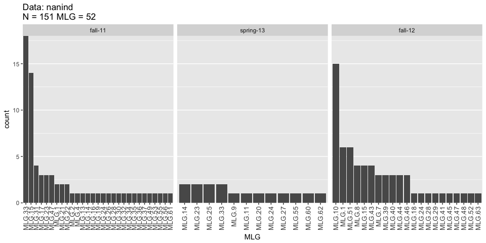<!-- -->

```r
#write.table(ult.tab, sep = ",", file = "~/Documents/genotypewithtoutmissing.csv")
```

Hardy-Weinberg equilibrium at each loci
_______________________________________


```r
#replacing missin data with mean allele frequency ask
#hardy weinberg equilibrium
library(pegas)
nanhwe.full <- pegas::hw.test(ultimhier)
kable(nanhwe.full, format = "markdown")

#By population

nanhwe.pop  <- setPop(ultimhier, ~Season) %>% seppop() %>% lapply(pegas::hw.test, B=0)
nanhwe.mat <- sapply(nanhwe.pop, "[", i = TRUE, j = 3)

alpha <- 0.05
newmat <- nanhwe.mat
newmat[newmat > alpha] <- 1
lattice::levelplot(t(newmat))
```


Genetic richness
_________________

```r
library("vegan")
```

```
## Loading required package: permute
```

```
## Loading required package: lattice
```

```
## This is vegan 2.4-5
```

```r
mon.tab <- mlg.table(ultimhier, plot = FALSE)
min_sample <- min(rowSums(mon.tab))
rarecurve(mon.tab, sample = min_sample, xlab = "Sample Size", ylab = "Expected MLGs")
title("Rarefaction of P. ultimum in 4 seasons")
```

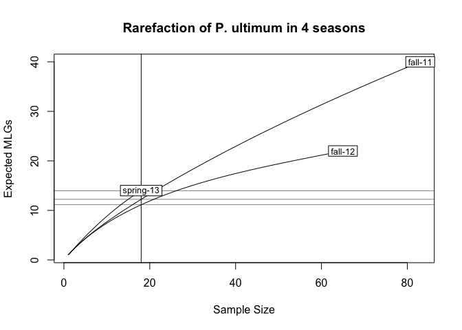<!-- -->

```r
mon.tab <- mlg.table(ultimhier)
```

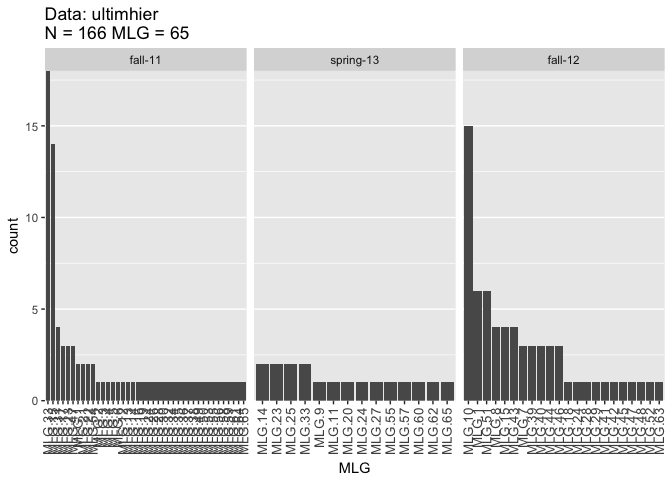<!-- -->


Linkage desiquilibrium
______________________


```r
#Linkage desequilibrium
ultimhier %>% setPop(~Season) %>% poppr(sample= 999, total = FALSE)
```

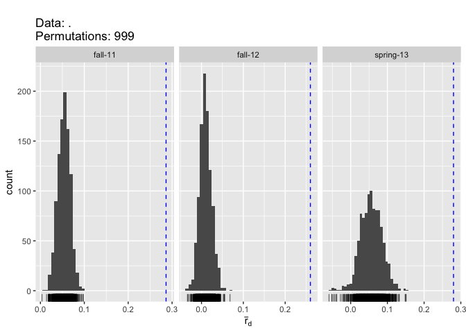<!-- -->

```
##         Pop  N MLG eMLG   SE    H    G lambda   E.5  Hexp   Ia  p.Ia rbarD
## 1   fall-11 83  40 12.2 1.75 3.09 11.3  0.912 0.489 0.529 1.26 0.001 0.286
## 2 spring-13 18  14 14.0 0.00 2.58 12.5  0.920 0.937 0.497 1.32 0.001 0.280
## 3   fall-12 65  22 11.1 1.48 2.71 10.5  0.905 0.680 0.511 1.25 0.001 0.260
##    p.rD File
## 1 0.001    .
## 2 0.001    .
## 3 0.001    .
```

```r
#Clone correcting by season and year
setPop(ultimhier) <- ~County/Season
ult.cc <- clonecorrect(ultimhier, ~County/Season, keep = 1:2)

ult.cc %>% setPop(~Season) %>% poppr(sample= 999, total = FALSE)
```

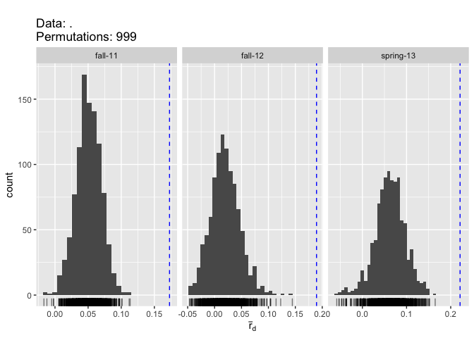<!-- -->

```
##         Pop  N MLG eMLG       SE    H    G lambda   E.5  Hexp    Ia  p.Ia
## 1   fall-11 40  40 15.0 1.80e-06 3.69 40.0  0.975 1.000 0.549 0.772 0.001
## 2 spring-13 15  14 14.0 0.00e+00 2.62 13.2  0.924 0.965 0.516 1.048 0.001
## 3   fall-12 24  22 14.2 6.62e-01 3.06 20.6  0.951 0.960 0.537 0.916 0.001
##   rbarD  p.rD File
## 1 0.173 0.001    .
## 2 0.221 0.001    .
## 3 0.189 0.001    .
```


PCA
-------


```r
ult.2 <- setPop(ultimhier, ~County)
Py.x <- scaleGen(ult.2, NA.method="mean", scale=FALSE)
#Py.pca <- dudi.pca(Py.x, center = FALSE, scale = FALSE)
Py.pca <- dudi.pca(Py.x, center = FALSE, scale = FALSE, nf = 3, scannf = FALSE)
Py.pca
```

```
## Duality diagramm
## class: pca dudi
## $call: dudi.pca(df = Py.x, center = FALSE, scale = FALSE, scannf = FALSE, 
##     nf = 3)
## 
## $nf: 3 axis-components saved
## $rank: 17
## eigen values: 0.6065 0.4149 0.198 0.1563 0.09515 ...
##   vector length mode    content       
## 1 $cw    23     numeric column weights
## 2 $lw    166    numeric row weights   
## 3 $eig   17     numeric eigen values  
## 
##   data.frame nrow ncol content             
## 1 $tab       166  23   modified array      
## 2 $li        166  3    row coordinates     
## 3 $l1        166  3    row normed scores   
## 4 $co        23   3    column coordinates  
## 5 $c1        23   3    column normed scores
## other elements: cent norm
```

```r
s.label(Py.pca$li)
```

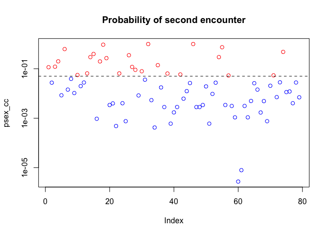<!-- -->

```r
s.class(Py.pca$li, fac=pop(ult.2), col = funky(10))
```

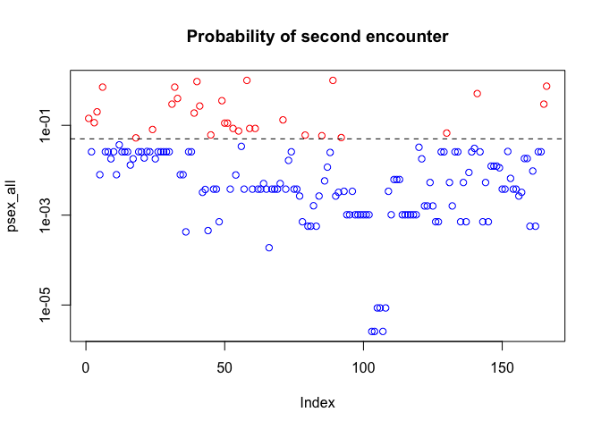<!-- -->

```r
eig.perc <- 100*Py.pca$eig/sum(Py.pca$eig)
eig.perc
```

```
##  [1] 36.55582681 25.00410996 11.93576669  9.42267489  5.73516848
##  [6]  3.61080194  1.66136439  1.33446702  1.20858134  0.96440471
## [11]  0.87222635  0.72373819  0.45520405  0.29052296  0.12978685
## [16]  0.09343280  0.00192257
```

```r
library(factoextra)
```

```
## Welcome! Related Books: `Practical Guide To Cluster Analysis in R` at https://goo.gl/13EFCZ
```

```r
fviz_eig(Py.pca)
```

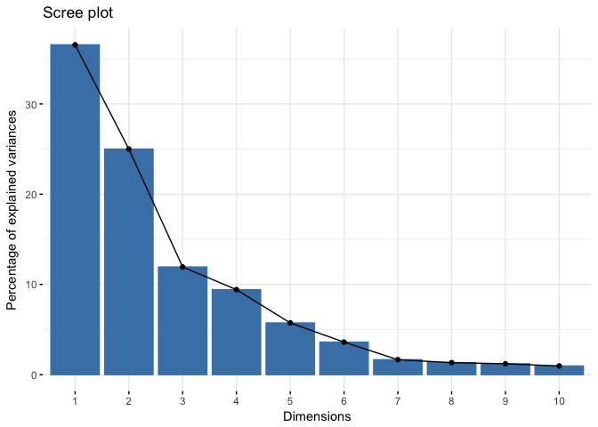<!-- -->

```r
fviz_pca_var(Py.pca,
  col.var = "contrib", # Color by contributions to the PC
  gradient.cols = c("#00AFBB", "#E7B800", "#FC4E07"),
  repel = TRUE     # Avoid text overlapping
)
```

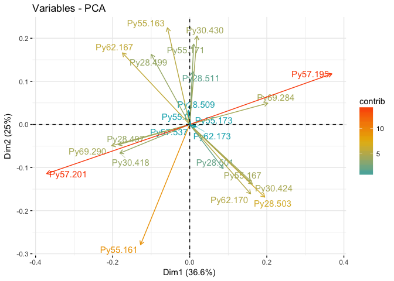<!-- -->

```r
groups.season <- setPop(ult.2, ~Season) %>% pop()
groups.county <- setPop(ult.2, ~County) %>% pop()

colores.county <- c("#636363", "#bdbdbd", "#f0f0f0")
fviz_pca_ind(Py.pca,
             col.ind = groups.season, # color by groups
             #palette = colores.county,
             addEllipses = TRUE, # Concentration ellipses
             #ellipse.type = "confidence",
             legend.title = "Groups"
             )
```

<!-- -->

```r
fviz_pca_ind(Py.pca,
             col.ind = groups.county, # color by groups
             #palette = colores.county,
             addEllipses = TRUE, # Concentration ellipses
             #ellipse.type = "confidence",
             legend.title = "Groups"
             )
```

<!-- -->

