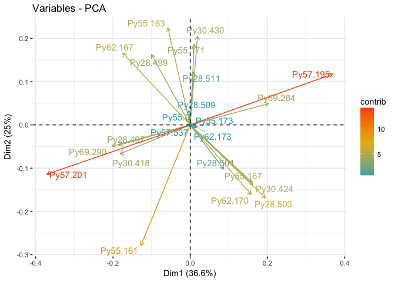
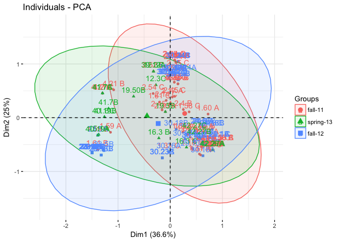
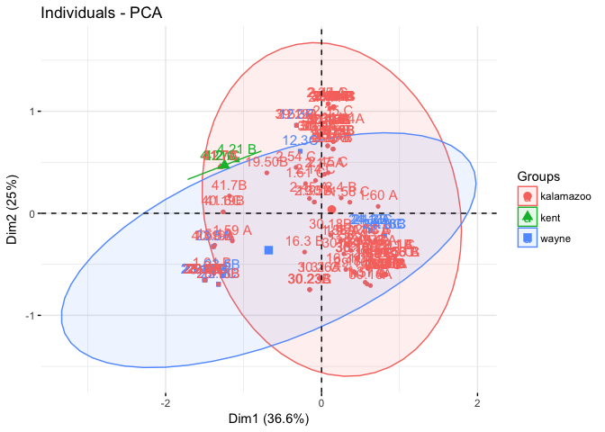

PCA
-------


```r
ult.2 <- setPop(ultimhier, ~County)
Py.x <- scaleGen(ult.2, NA.method="mean", scale=FALSE)
#Py.pca <- dudi.pca(Py.x, center = FALSE, scale = FALSE)
Py.pca <- dudi.pca(Py.x, center = FALSE, scale = FALSE, nf = 3, scannf = FALSE)
Py.pca
```

```
## Duality diagramm
## class: pca dudi
## $call: dudi.pca(df = Py.x, center = FALSE, scale = FALSE, scannf = FALSE, 
##     nf = 3)
## 
## $nf: 3 axis-components saved
## $rank: 17
## eigen values: 0.6065 0.4149 0.198 0.1563 0.09515 ...
##   vector length mode    content       
## 1 $cw    23     numeric column weights
## 2 $lw    166    numeric row weights   
## 3 $eig   17     numeric eigen values  
## 
##   data.frame nrow ncol content             
## 1 $tab       166  23   modified array      
## 2 $li        166  3    row coordinates     
## 3 $l1        166  3    row normed scores   
## 4 $co        23   3    column coordinates  
## 5 $c1        23   3    column normed scores
## other elements: cent norm
```

```r
s.label(Py.pca$li)
```

<!-- -->

```r
s.class(Py.pca$li, fac=pop(ult.2), col = funky(10))
```

<!-- -->

```r
eig.perc <- 100*Py.pca$eig/sum(Py.pca$eig)
eig.perc
```

```
##  [1] 36.55582681 25.00410996 11.93576669  9.42267489  5.73516848
##  [6]  3.61080194  1.66136439  1.33446702  1.20858134  0.96440471
## [11]  0.87222635  0.72373819  0.45520405  0.29052296  0.12978685
## [16]  0.09343280  0.00192257
```

```r
library(factoextra)
```

```
## Welcome! Related Books: `Practical Guide To Cluster Analysis in R` at https://goo.gl/13EFCZ
```

```r
fviz_eig(Py.pca)
```

<!-- -->

```r
fviz_pca_var(Py.pca,
  col.var = "contrib", # Color by contributions to the PC
  gradient.cols = c("#00AFBB", "#E7B800", "#FC4E07"),
  repel = TRUE     # Avoid text overlapping
)
```

<!-- -->

```r
groups.season <- setPop(ult.2, ~Season) %>% pop()
groups.county <- setPop(ult.2, ~County) %>% pop()

colores.county <- c("#636363", "#bdbdbd", "#f0f0f0")
fviz_pca_ind(Py.pca,
             col.ind = groups.season, # color by groups
             #palette = colores.county,
             addEllipses = TRUE, # Concentration ellipses
             #ellipse.type = "confidence",
             legend.title = "Groups"
             )
```

<!-- -->

```r
fviz_pca_ind(Py.pca,
             col.ind = groups.county, # color by groups
             #palette = colores.county,
             addEllipses = TRUE, # Concentration ellipses
             #ellipse.type = "confidence",
             legend.title = "Groups"
             )
```

<!-- -->

