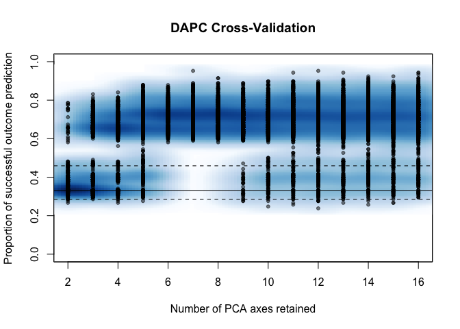
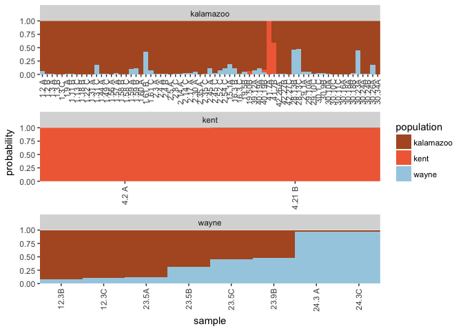

# PCA analysis


```r
ult.2 <- setPop(ultimhier, ~County)
Py.x <- scaleGen(ult.2, NA.method="mean", scale=FALSE)
#Py.pca <- dudi.pca(Py.x, center = FALSE, scale = FALSE)
Py.pca <- dudi.pca(Py.x, center = FALSE, scale = FALSE, nf = 3, scannf = FALSE)
Py.pca
```

```
## Duality diagramm
## class: pca dudi
## $call: dudi.pca(df = Py.x, center = FALSE, scale = FALSE, scannf = FALSE, 
##     nf = 3)
## 
## $nf: 3 axis-components saved
## $rank: 17
## eigen values: 0.6065 0.4149 0.198 0.1563 0.09515 ...
##   vector length mode    content       
## 1 $cw    23     numeric column weights
## 2 $lw    166    numeric row weights   
## 3 $eig   17     numeric eigen values  
## 
##   data.frame nrow ncol content             
## 1 $tab       166  23   modified array      
## 2 $li        166  3    row coordinates     
## 3 $l1        166  3    row normed scores   
## 4 $co        23   3    column coordinates  
## 5 $c1        23   3    column normed scores
## other elements: cent norm
```

```r
s.label(Py.pca$li)
```

<!-- -->

```r
s.class(Py.pca$li, fac=pop(ult.2), col = funky(10))
```

<!-- -->

```r
eig.perc <- 100*Py.pca$eig/sum(Py.pca$eig)
eig.perc
```

```
##  [1] 36.55582681 25.00410996 11.93576669  9.42267489  5.73516848
##  [6]  3.61080194  1.66136439  1.33446702  1.20858134  0.96440471
## [11]  0.87222635  0.72373819  0.45520405  0.29052296  0.12978685
## [16]  0.09343280  0.00192257
```

```r
library(factoextra)
fviz_eig(Py.pca)
```

<!-- -->


**Variance**

_________


```r
fviz_pca_var(Py.pca,
  col.var = "contrib", # Color by contributions to the PC
  gradient.cols = c("#00AFBB", "#E7B800", "#FC4E07"),
  repel = TRUE     # Avoid text overlapping
)
```

<!-- -->


**PCA by Season**

______________


```r
groups.season <- setPop(ult.2, ~Season) %>% pop()
groups.county <- setPop(ult.2, ~County) %>% pop()

colores.county <- c("#636363", "#bdbdbd", "#f0f0f0")
fviz_pca_ind(Py.pca,
             col.ind = groups.season, # color by groups
             #palette = colores.county,
             addEllipses = TRUE, # Concentration ellipses
             #ellipse.type = "confidence",
             legend.title = "Groups"
             )
```

<!-- -->


**PCA by County**

______________


```r
fviz_pca_ind(Py.pca,
             col.ind = groups.county, # color by groups
             #palette = colores.county,
             addEllipses = TRUE, # Concentration ellipses
             #ellipse.type = "confidence",
             legend.title = "Groups"
             )
```

<!-- -->


# DAPC analysis of _Pythium ultimum_ in Michigan


```r
library(adegenet)

ult.cc <- setPop(ult.cc, ~County)

set.seed(999)
py.xval <- xvalDapc(tab(ult.cc, NA.method = "mean"), pop(ult.cc), 
                    n.pca = 2:30,
                    n.rep = 1000,
                    parallel = "multicore", 
                    ncpus = 4L)
```

<!-- -->

```r
py.xval$DAPC
```

```
## 	#################################################
## 	# Discriminant Analysis of Principal Components #
## 	#################################################
## class: dapc
## $call: dapc.data.frame(x = as.data.frame(x), grp = ..1, n.pca = ..2, 
##     n.da = ..3)
## 
## $n.pca: 8 first PCs of PCA used
## $n.da: 2 discriminant functions saved
## $var (proportion of conserved variance): 0.93
## 
## $eig (eigenvalues): 18.33 14.8  vector    length content                   
## 1 $eig      2      eigenvalues               
## 2 $grp      79     prior group assignment    
## 3 $prior    3      prior group probabilities 
## 4 $assign   79     posterior group assignment
## 5 $pca.cent 23     centring vector of PCA    
## 6 $pca.norm 23     scaling vector of PCA     
## 7 $pca.eig  17     eigenvalues of PCA        
## 
##   data.frame    nrow ncol
## 1 $tab          79   8   
## 2 $means        3    8   
## 3 $loadings     8    2   
## 4 $ind.coord    79   2   
## 5 $grp.coord    3    2   
## 6 $posterior    79   3   
## 7 $pca.loadings 23   8   
## 8 $var.contr    23   2   
##   content                                          
## 1 retained PCs of PCA                              
## 2 group means                                      
## 3 loadings of variables                            
## 4 coordinates of individuals (principal components)
## 5 coordinates of groups                            
## 6 posterior membership probabilities               
## 7 PCA loadings of original variables               
## 8 contribution of original variables
```


Using this validation, 10 PCs give us the lowest error.


```r
py.county <- py.xval$DAPC

scatter(py.county, 
        scree.pca = TRUE,
        bg = "grey95",
        col = "black",
        pch = seq(nlevels(strata(ult.cc)$County)),
        legend = "true",
        posi.leg = "topleft",
        posi.pca = "topright"
        )
```

<!-- -->

**By County **

____________


```r
library(ggcompoplot)
ggcompoplot(py.county, setPop(ult.cc, ~County), pal = rev(funky(nlevels(strata(ult.cc)$County))), cols = 1)
```

<!-- -->

**By Season**

________________


```r
ggcompoplot(py.county, setPop(ult.cc, ~Season), pal = rev(funky(nlevels(strata(ult.cc)$Season))), cols = 1)
```

<!-- -->

**By County and Season**

_________________________


```r
ggcompoplot(py.county, setPop(ult.cc, ~County/Season), pal = rev(funky(nlevels(strata(ult.cc)$County))), cols = 1)
```

<!-- -->


