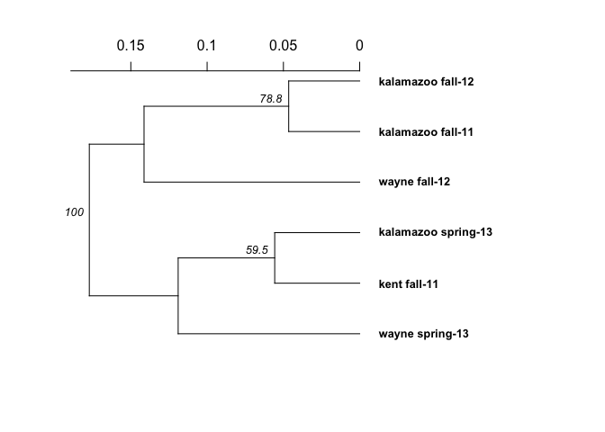
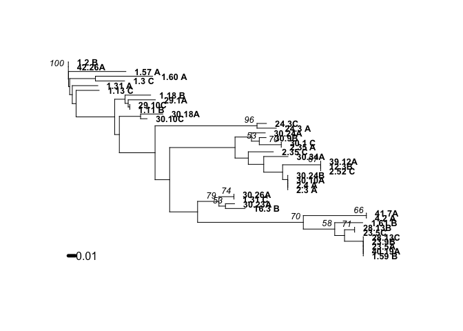
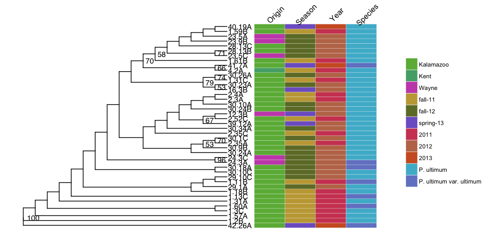
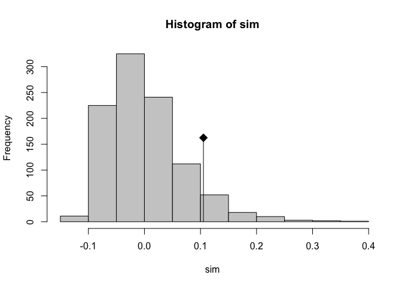
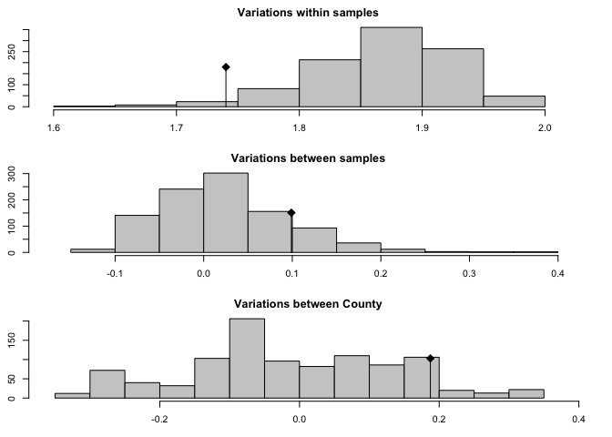

# Assesing population structure using Hendrick's Gst


```r
#Gst
Gst_Hedrick(clonecorrect(ultimhier, ~County/Season, keep = 1:2))
```

```
## $per.locus
##         Py28         Py62         Py69         Py30         Py55 
##  0.514023333  0.064589738 -0.006064058  0.126695184  0.629411956 
##         Py57 
##  0.481884660 
## 
## $global
## [1] 0.3201126
```

# Genetic distance


## County and season using Nei's distance

```r
set.seed(999)
ultimhier %>%
genind2genpop(pop = ~County/Season) %>%
aboot(cutoff = 50, quiet = TRUE, sample = 1000, distance = nei.dist)
```

```
## 
##  Converting data from a genind to a genpop object... 
## 
## ...done.
```

<!-- -->

```
## 
## Phylogenetic tree with 6 tips and 5 internal nodes.
## 
## Tip labels:
## [1] "kalamazoo_fall-11"   "kent_fall-11"        "wayne_spring-13"    
## [4] "kalamazoo_spring-13" "wayne_fall-12"       "kalamazoo_fall-12"  
## Node labels:
## [1] 100.0    NA    NA  78.8  59.5
## 
## Rooted; includes branch lengths.
```

## Tree using Bruvo's distance


```r
#Repeat length
ssr.reps <- c(3, 3, 6, 6, 2, 3)

#Bruvo
setPop(ult.cc) <- ~Season
ult.tree <- bruvo.boot(ult.cc, 
                       replen = ssr.reps, 
                       sample = 1000,
                       tree ="nj", 
                       cutoff = 50, 
                       quiet = TRUE)
```

```
## Warning in bruvo.boot(ult.cc, replen = ssr.reps, sample = 1000, tree =
## "nj", : Some branch lengths of the tree are negative. Normalizing branches
## according to Kuhner and Felsenstein (1994)
```

<!-- -->

```r
ult.tree$tip.label <- stringr::str_trim(ult.tree$tip.label) %>% 
  stringr::str_replace_all(" ","")


Py_metadata <- read.csv("../data/Py_metadata.csv") %>%
  select(Isolate, Origin, Season, Year, Species) %>%
  column_to_rownames("Isolate")

ult.tr2 <- ggtree(ult.tree, branch.length = "none", layout = "circular") + 
  geom_tiplab2(align = TRUE) + 
  geom_text2(aes(label=label, subset = !is.na(as.numeric(label)) & as.numeric(label) > 50), vjust =-1, hjust=-.3) + 
  xlim_tree(10) +
  theme_tree()
```


```r
colors <- c("#cf4661","#bf7658","#ce5d2a",
            "#c4a643","#6e7a32","#6ab544",
            "#53aa78","#4cb8d1","#7385cb",
            "#7e63cb","#c851b8","#bf679b")

#Adding heatmap
ult.tr3 <- gheatmap(ult.tr2, Py_metadata, colnames = FALSE, width = 0.4, offset = 3.5)

#Formatting colors and legend for heatmap
lbl <- get_heatmap_column_position(ult.tr3, by="top")
ult.tr3 + scale_fill_manual(breaks=c("Kalamazoo","Kent","Wayne","fall-11","fall-12","spring-13","2011","2012","2013",
                                       "P. ultimum ", "P. ultimum var. ultimum"), values = colors) +
  geom_text(data=lbl, aes(x, y, label=label), 
            nudge_y = 1, 
            nudge_x = -.7, 
            angle=60,
            size=4)
```




# AMOVA


```r
#AMOVA

#Replacing mising data with 0
ult.nan <- missingno(ultimhier, "geno")
```

```
## 
## Found 313 missing values.
## 
## 42 genotypes contained missing values greater than 5%
## 
## Removing 42 genotypes: 1.2 A, 1.3 A, 1.3 B, 1.9 A, 1.22 C, 1.44 A,
## 1.49 C, 1.55 A, 1.56 A, 1.58 B, 1.58 C, 1.59 A, 1.61 C, 2.4 B, 2.5
## A , 2.5 C, 2.8 C, 2.14 A , 2.14 C, 2.17 A, 2.30 A, 2.30 B, 2.33 A
## , 2.45 A, 2.45 C, 2.54 C, 4.21 B, 12.3C, 15.1A, 16.3 C, 19.5B,
## 19.50B, 23.5B, 29.10A, 30.11C, 30.16A, 30.18B, 40.19B, 41.6C,
## 41.7B, 42.27B, 42.27C
```

```r
ult.nan.cc <-  clonecorrect(ult.nan, ~County/Season)

#AMOVA on clone corrected data without missing values
(ultimhieramova <- poppr.amova(ult.nan.cc, ~Season, within = TRUE))
```

```
## 
##  No missing values detected.
```

```
## $call
## ade4::amova(samples = xtab, distances = xdist, structures = xstruct)
## 
## $results
##                               Df     Sum Sq  Mean Sq
## Between Season                 2   6.305138 3.152569
## Between samples Within Season 39  70.254386 1.801395
## Within samples                42  62.500000 1.488095
## Total                         83 139.059524 1.675416
## 
## $componentsofcovariance
##                                                Sigma          %
## Variations  Between Season                0.05264316   3.101422
## Variations  Between samples Within Season 0.15664964   9.228864
## Variations  Within samples                1.48809524  87.669714
## Total variations                          1.69738803 100.000000
## 
## $statphi
##                           Phi
## Phi-samples-total  0.12330286
## Phi-samples-Season 0.09524251
## Phi-Season-total   0.03101422
```

```r
(ultimhieramova0 <- poppr.amova(ult.nan.cc, ~County/Season))
```

```
## 
##  No missing values detected.
```

```
## $call
## ade4::amova(samples = xtab, distances = xdist, structures = xstruct)
## 
## $results
##                               Df     Sum Sq  Mean Sq
## Between County                 2   6.409524 3.204762
## Between Season Within County   3   7.500893 2.500298
## Between samples Within Season 36  62.649107 1.740253
## Within samples                42  62.500000 1.488095
## Total                         83 139.059524 1.675416
## 
## $componentsofcovariance
##                                                Sigma          %
## Variations  Between County                0.09370442   5.332099
## Variations  Between Season Within County  0.04948616   2.815930
## Variations  Between samples Within Season 0.12607887   7.174314
## Variations  Within samples                1.48809524  84.677656
## Total variations                          1.75736469 100.000000
## 
## $statphi
##                           Phi
## Phi-samples-total  0.15322344
## Phi-samples-Season 0.07810735
## Phi-Season-County  0.02974535
## Phi-County-total   0.05332099
```

```r
#Writing results to file
# write.table(ultimhieramova$componentsofcovariance, sep = ",", file = "~/Documents/ultimhierAMOVA.csv")
# write.table(ultimhieramova$statphi, sep = ",", file = "~/Documents/ultimhierphiAMOVA.csv")

#Significance
set.seed(1999)
(ultmsignif   <- randtest(ultimhieramova, nrepet = 1000))
```

```
## class: krandtest lightkrandtest 
## Monte-Carlo tests
## Call: randtest.amova(xtest = ultimhieramova, nrepet = 1000)
## 
## Number of tests:   3 
## 
## Adjustment method for multiple comparisons:   none 
## Permutation number:   1000 
##                         Test        Obs   Std.Obs   Alter     Pvalue
## 1  Variations within samples 1.48809524 -1.786049    less 0.05194805
## 2 Variations between samples 0.15664964  1.423197 greater 0.06693307
## 3  Variations between Season 0.05264316  1.586280 greater 0.06493506
```

```r
plot(ultmsignif)
```

<!-- -->

```r
set.seed(1999)
(ultmsignif0 <- randtest(ultimhieramova0, nrepet = 1000))
```

```
## class: krandtest lightkrandtest 
## Monte-Carlo tests
## Call: randtest.amova(xtest = ultimhieramova0, nrepet = 1000)
## 
## Number of tests:   4 
## 
## Adjustment method for multiple comparisons:   none 
## Permutation number:   1000 
##                         Test        Obs    Std.Obs   Alter     Pvalue
## 1  Variations within samples 1.48809524 -1.8251857    less 0.04295704
## 2 Variations between samples 0.12607887  1.0135925 greater 0.17482517
## 3  Variations between Season 0.04948616  0.9748944 greater 0.15384615
## 4  Variations between County 0.09370442  1.3155281 greater 0.10489510
```

```r
plot(ultmsignif0)
```

<!-- -->


