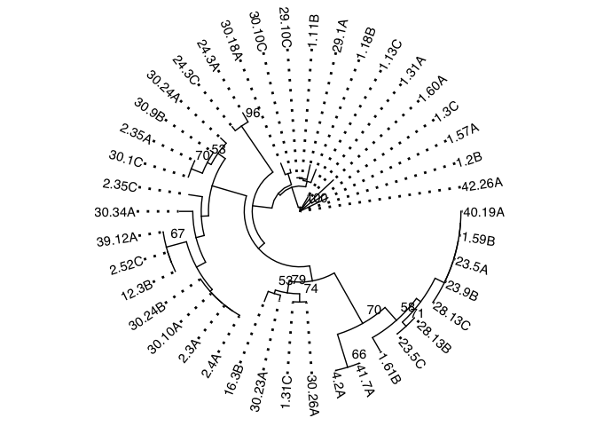
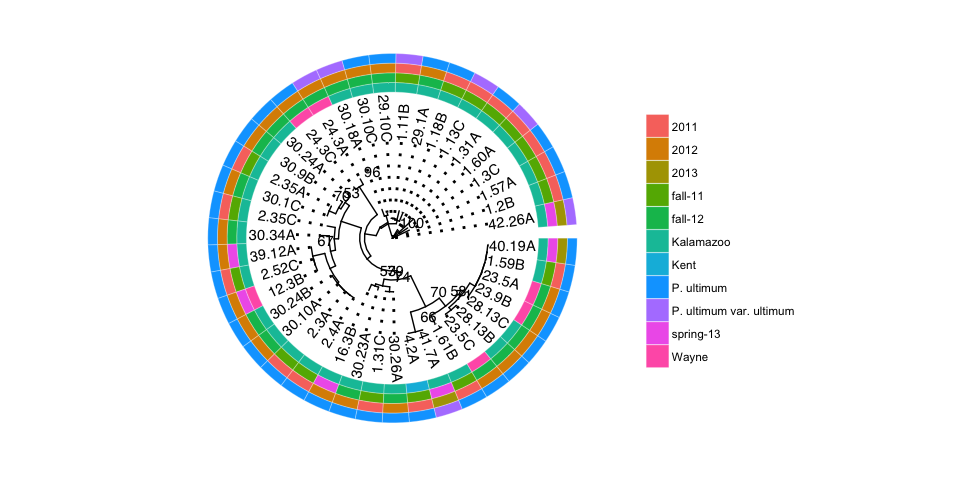

# Assesing population structure using Hendrick's Gst


```r
#Gst
Gst_Hedrick(clonecorrect(ultimhier, ~County/Season, keep = 1:2))
```

```
## $per.locus
##         Py28         Py62         Py69         Py30         Py55 
##  0.514023333  0.064589738 -0.006064058  0.126695184  0.629411956 
##         Py57 
##  0.481884660 
## 
## $global
## [1] 0.3201126
```

# Genetic distance


## County and season using Nei's distance

```r
set.seed(999)
ultimhier %>%
genind2genpop(pop = ~County/Season) %>%
aboot(cutoff = 50, quiet = TRUE, sample = 1000, distance = nei.dist)
```

```
## 
##  Converting data from a genind to a genpop object... 
## 
## ...done.
```

<!-- -->

```
## 
## Phylogenetic tree with 6 tips and 5 internal nodes.
## 
## Tip labels:
## [1] "kalamazoo_fall-11"   "kent_fall-11"        "wayne_spring-13"    
## [4] "kalamazoo_spring-13" "wayne_fall-12"       "kalamazoo_fall-12"  
## Node labels:
## [1] 100.0    NA    NA  78.8  59.5
## 
## Rooted; includes branch lengths.
```

## Tree using Bruvo's distance


```r
#Repeat length
ssr.reps <- c(3, 3, 6, 6, 2, 3)

#Bruvo
setPop(ult.cc) <- ~Season
ult.tree <- bruvo.boot(ult.cc, 
                       replen = ssr.reps, 
                       sample = 1000,
                       tree ="nj", 
                       cutoff = 50, 
                       quiet = TRUE)
```

```
## Warning in bruvo.boot(ult.cc, replen = ssr.reps, sample = 1000, tree =
## "nj", : Some branch lengths of the tree are negative. Normalizing branches
## according to Kuhner and Felsenstein (1994)
```

<!-- -->

```r
ult.tree$tip.label <- stringr::str_trim(ult.tree$tip.label) %>% 
  stringr::str_replace_all(" ","")


Py_metadata <- read.csv("../data/Py_metadata.csv") %>%
  select(Isolate, Origin, Season, Year, Species) %>%
  column_to_rownames("Isolate")

(ult.tr2 <- ggtree(ult.tree, layout = "circular") + 
  geom_tiplab2(align = TRUE) + 
  geom_text2(aes(label=label, subset = !is.na(as.numeric(label)) & as.numeric(label) > 50), vjust =-1, hjust=-.3) + 
  xlim_tree(0.1) +
  theme_tree())
```

```
## Warning in fun(x, ...): NAs introduced by coercion
```

```
## Warning in fun(x, ...): NAs introduced by coercion
```

```
## Warning in FUN(X[[i]], ...): NAs introduced by coercion

## Warning in FUN(X[[i]], ...): NAs introduced by coercion
```

<!-- -->


```r
colors <- c("#cf4661","#bf7658","#ce5d2a",
            "#c4a643","#6e7a32","#6ab544",
            "#53aa78","#4cb8d1","#7385cb",
            "#7e63cb","#c851b8","#bf679b")

#Adding heatmap
(ult.tr3 <- gheatmap(ult.tr2, Py_metadata, colnames = FALSE, width = 0.4, offset = 0.2))
```



```r
#Formatting colors and legend for heatmap
lbl <- get_heatmap_column_position(ult.tr3, by="top")
ult.tr3 + scale_fill_manual(breaks=c("Kalamazoo","Kent","Wayne","fall-11","fall-12","spring-13","2011","2012","2013",
                                       "P. ultimum ", "P. ultimum var. ultimum"), values = colors) +
  geom_text(data=lbl, aes(x, y, label=label), 
            nudge_y = 0.3, 
            nudge_x = -0.03, 
            angle=60,
            size=4)
```


# AMOVA


```r
#AMOVA

#Replacing mising data with 0
ult.nan <- missingno(ultimhier, "geno")
```

```
## 
## Found 313 missing values.
## 
## 42 genotypes contained missing values greater than 5%
## 
## Removing 42 genotypes: 1.2 A, 1.3 A, 1.3 B, 1.9 A, 1.22 C, 1.44 A,
## 1.49 C, 1.55 A, 1.56 A, 1.58 B, 1.58 C, 1.59 A, 1.61 C, 2.4 B, 2.5
## A , 2.5 C, 2.8 C, 2.14 A , 2.14 C, 2.17 A, 2.30 A, 2.30 B, 2.33 A
## , 2.45 A, 2.45 C, 2.54 C, 4.21 B, 12.3C, 15.1A, 16.3 C, 19.5B,
## 19.50B, 23.5B, 29.10A, 30.11C, 30.16A, 30.18B, 40.19B, 41.6C,
## 41.7B, 42.27B, 42.27C
```

```r
ult.nan.cc <-  clonecorrect(ult.nan, ~County/Season)

#AMOVA on clone corrected data without missing values
(ultimhieramova <- poppr.amova(ult.nan.cc, ~Season, within = TRUE))
```

```
## 
##  No missing values detected.
```

```
## Warning in poppr.amova(ult.nan.cc, ~Season, within = TRUE): Data with mixed ploidy or ambiguous allele dosage cannot have within-individual variance calculated until the dosage is correctly estimated.
## 
##  This function will return the summary statistic, rho (Ronfort et al 1998) but be aware that this estimate will be skewed due to ambiguous dosage. If you have zeroes encoded in your data, you may wish to remove them.
##  To remove this warning, use within = FALSE
```

```
## $call
## ade4::amova(samples = xtab, distances = xdist, structures = xstruct)
## 
## $results
##                 Df    Sum Sq  Mean Sq
## Between samples  2  6.305138 3.152569
## Within samples  39 70.254386 1.801395
## Total           41 76.559524 1.867305
## 
## $componentsofcovariance
##                                 Sigma          %
## Variations  Between samples 0.1052863   5.521969
## Variations  Within samples  1.8013945  94.478031
## Total variations            1.9066808 100.000000
## 
## $statphi
##                          Phi
## Phi-samples-total 0.05521969
```

```r
(ultimhieramova0 <- poppr.amova(ult.nan.cc, ~County/Season))
```

```
## 
##  No missing values detected.
```

```
## Warning in poppr.amova(ult.nan.cc, ~County/Season): Data with mixed ploidy or ambiguous allele dosage cannot have within-individual variance calculated until the dosage is correctly estimated.
## 
##  This function will return the summary statistic, rho (Ronfort et al 1998) but be aware that this estimate will be skewed due to ambiguous dosage. If you have zeroes encoded in your data, you may wish to remove them.
##  To remove this warning, use within = FALSE
```

```
## $call
## ade4::amova(samples = xtab, distances = xdist, structures = xstruct)
## 
## $results
##                               Df    Sum Sq  Mean Sq
## Between County                 2  6.409524 3.204762
## Between samples Within County  3  7.500893 2.500298
## Within samples                36 62.649107 1.740253
## Total                         41 76.559524 1.867305
## 
## $componentsofcovariance
##                                                Sigma          %
## Variations  Between County                0.18740885   9.247295
## Variations  Between samples Within County 0.09897233   4.883581
## Variations  Within samples                1.74025298  85.869123
## Total variations                          2.02663415 100.000000
## 
## $statphi
##                           Phi
## Phi-samples-total  0.14130877
## Phi-samples-County 0.05381197
## Phi-County-total   0.09247295
```

```r
#Writing results to file
# write.table(ultimhieramova$componentsofcovariance, sep = ",", file = "~/Documents/ultimhierAMOVA.csv")
# write.table(ultimhieramova$statphi, sep = ",", file = "~/Documents/ultimhierphiAMOVA.csv")

#Significance
set.seed(1999)
(ultmsignif   <- randtest(ultimhieramova, nrepet = 1000))
```

```
## Monte-Carlo test
## Call: as.randtest(sim = res, obs = sigma[1])
## 
## Observation: 0.1052863 
## 
## Based on 1000 replicates
## Simulated p-value: 0.08591409 
## Alternative hypothesis: greater 
## 
##     Std.Obs Expectation    Variance 
## 1.492728411 0.002857985 0.004708457
```

```r
plot(ultmsignif)
```

<!-- -->

```r
set.seed(1999)
(ultmsignif0 <- randtest(ultimhieramova0, nrepet = 1000))
```

```
## class: krandtest lightkrandtest 
## Monte-Carlo tests
## Call: randtest.amova(xtest = ultimhieramova0, nrepet = 1000)
## 
## Number of tests:   3 
## 
## Adjustment method for multiple comparisons:   none 
## Permutation number:   1000 
##                         Test        Obs   Std.Obs   Alter     Pvalue
## 1  Variations within samples 1.74025298 -2.231036    less 0.02497502
## 2 Variations between samples 0.09897233  1.025227 greater 0.15084915
## 3  Variations between County 0.18740885  1.406895 greater 0.09890110
```

```r
plot(ultmsignif0)
```

<!-- -->

