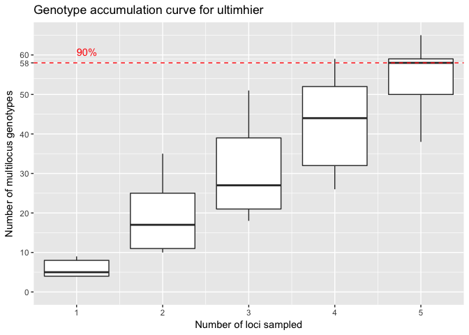
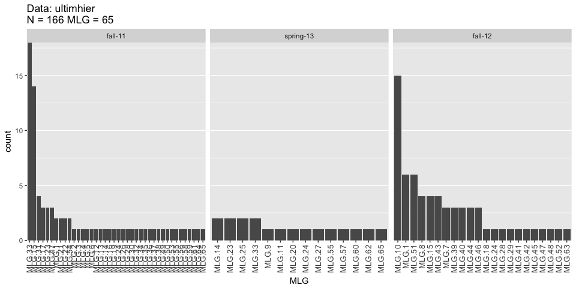
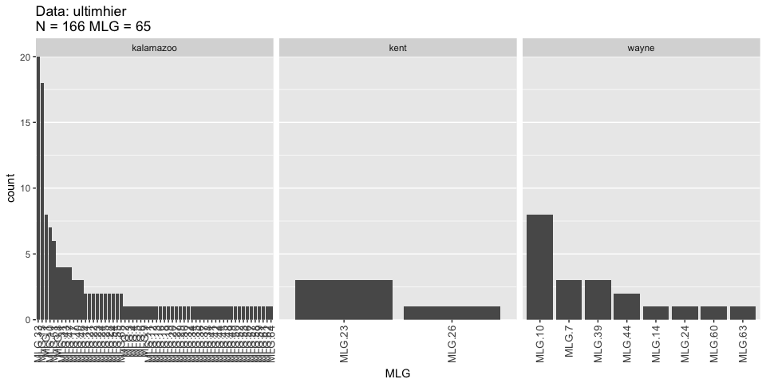

# Pythium populations in Michigan greenhouses


##Data input

```r
#Reading genealex object
ultimhier <- read.genalex("../data/ult3pop.csv")

#recode populations
ultimhier@pop <- dplyr::recode(ultimhier@pop, "d_ff"="wayne_fall-12", "d_ss"="wayne_spring-13", 
       "g_f"="kent_fall-11", "k_f"="kalamazoo_fall-11", "k_ff"="kalamazoo_fall-12",
       "k_ss"="kalamazoo_spring-13")
```


##Genotype accumulation curve
The aim is to determine the if the SSRs are enough to describe the genotypes in the population.


```r
#Locus table
locus_table(ultimhier)
```

```
## 
## allele = Number of observed alleles
## 1-D = Simpson index
## Hexp = Nei's 1978 gene diversity
## ------------------------------------------
```

```
##       summary
## locus  allele  1-D Hexp Evenness
##   Py28   6.00 0.80 0.80     0.92
##   Py62   3.00 0.36 0.36     0.68
##   Py69   2.00 0.48 0.49     0.97
##   Py30   3.00 0.54 0.54     0.77
##   Py55   5.00 0.73 0.73     0.87
##   Py57   3.00 0.39 0.39     0.78
##   mean   3.67 0.55 0.55     0.83
```

```r
#genotype accumulation curve
gac <- genotype_curve(ultimhier, sample = 1000, quiet = TRUE)
```

<!-- -->

##Genotype diversity
Basic summary of Pythium population data and definition of multilocus genotypes.

```r
ult_table <- poppr(ultimhier)
knitr::kable(ult_table[,-13], format="markdown", digits = 3,
             caption=" Summary statistics of P. ultimum populations")
```


|Pop                 |   N| MLG|  eMLG|    SE|     H|      G| lambda|   E.5|  Hexp|    Ia| rbarD|
|:-------------------|---:|---:|-----:|-----:|-----:|------:|------:|-----:|-----:|-----:|-----:|
|wayne_fall-12       |  18|   6| 4.791| 0.774| 1.523|  3.682|  0.728| 0.748| 0.383| 3.188| 0.704|
|wayne_spring-13     |   2|   2| 2.000| 0.000| 0.693|  2.000|  0.500| 1.000| 0.611|    NA|    NA|
|kent_fall-11        |   4|   2| 2.000| 0.000| 0.562|  1.600|  0.375| 0.795| 0.000|   NaN|   NaN|
|kalamazoo_fall-11   |  79|  38| 7.538| 1.302| 3.019| 10.419|  0.904| 0.484| 0.520| 1.138| 0.267|
|kalamazoo_fall-12   |  47|  18| 7.462| 1.097| 2.609| 11.213|  0.911| 0.812| 0.511| 1.284| 0.275|
|kalamazoo_spring-13 |  16|  13| 8.875| 0.743| 2.513| 11.636|  0.914| 0.938| 0.482| 1.530| 0.326|
|Total               | 166|  65| 8.519| 1.086| 3.629| 21.562|  0.954| 0.561| 0.550| 1.194| 0.256|

Generating a table for the multilocus genotypes accors populations

```r
#Matrix indicating mulitlocus genotypes (MLGs) by population
ult.tab <- mlg.table(ultimhier)
```

<!-- -->

```r
#Associating MLGs to individual names
mlg.id <- mlg.id(ultimhier)
#write.table(mlg.id, sep = ",", file = "~/Documents/mlgID.csv")
```


##Hierarchy and strata by factors

First, the strata will be recoded to facilitate interpretation of the data.  Then, the strata will be divided to generated a nested 
hierarchy.  The idea is that season is nested within county.

```r
#recode strata
ultimhier@strata$Pop <- recode(ultimhier@strata$Pop, "d_ff"="wayne_fall-12", "d_ss"="wayne_spring-13", 
       "g_f"="kent_fall-11", "k_f"="kalamazoo_fall-11", "k_ff"="kalamazoo_fall-12",
       "k_ss"="kalamazoo_spring-13")

#hierarchy splithierarchy was deprecated, so command is updated to last version poppr
splitStrata(ultimhier) <- ~County/Season

#Accessing strata data of the genind object
ult.str <- strata(ultimhier)
knitr::kable(ult.str, format = "markdown")
```


|County    |Season    |
|:---------|:---------|
|kalamazoo |fall-11   |
|kalamazoo |fall-11   |
|kalamazoo |fall-11   |
|kalamazoo |fall-11   |
|kalamazoo |fall-11   |
|kalamazoo |fall-11   |
|kalamazoo |fall-11   |
|kalamazoo |fall-11   |
|kalamazoo |fall-11   |
|kalamazoo |fall-11   |
|kalamazoo |fall-11   |
|kalamazoo |fall-11   |
|kalamazoo |fall-11   |
|kalamazoo |fall-11   |
|kalamazoo |fall-11   |
|kalamazoo |fall-11   |
|kalamazoo |fall-11   |
|kalamazoo |fall-11   |
|kalamazoo |fall-11   |
|kalamazoo |fall-11   |
|kalamazoo |fall-11   |
|kalamazoo |fall-11   |
|kalamazoo |fall-11   |
|kalamazoo |fall-11   |
|kalamazoo |fall-11   |
|kalamazoo |fall-11   |
|kalamazoo |fall-11   |
|kalamazoo |fall-11   |
|kalamazoo |fall-11   |
|kalamazoo |fall-11   |
|kalamazoo |fall-11   |
|kalamazoo |fall-11   |
|kalamazoo |fall-11   |
|kalamazoo |fall-11   |
|kalamazoo |fall-11   |
|kalamazoo |fall-11   |
|kalamazoo |fall-11   |
|kalamazoo |fall-11   |
|kalamazoo |fall-11   |
|kalamazoo |fall-11   |
|kalamazoo |fall-11   |
|kalamazoo |fall-11   |
|kalamazoo |fall-11   |
|kalamazoo |fall-11   |
|kalamazoo |fall-11   |
|kalamazoo |fall-11   |
|kalamazoo |fall-11   |
|kalamazoo |fall-11   |
|kalamazoo |fall-11   |
|kalamazoo |fall-11   |
|kalamazoo |fall-11   |
|kalamazoo |fall-11   |
|kalamazoo |fall-11   |
|kalamazoo |fall-11   |
|kalamazoo |fall-11   |
|kalamazoo |fall-11   |
|kalamazoo |fall-11   |
|kalamazoo |fall-11   |
|kalamazoo |fall-11   |
|kalamazoo |fall-11   |
|kalamazoo |fall-11   |
|kalamazoo |fall-11   |
|kalamazoo |fall-11   |
|kalamazoo |fall-11   |
|kalamazoo |fall-11   |
|kalamazoo |fall-11   |
|kalamazoo |fall-11   |
|kalamazoo |fall-11   |
|kalamazoo |fall-11   |
|kalamazoo |fall-11   |
|kalamazoo |fall-11   |
|kalamazoo |fall-11   |
|kalamazoo |fall-11   |
|kalamazoo |fall-11   |
|kalamazoo |fall-11   |
|kalamazoo |fall-11   |
|kalamazoo |fall-11   |
|kalamazoo |fall-11   |
|kalamazoo |fall-11   |
|kent      |fall-11   |
|kent      |fall-11   |
|kent      |fall-11   |
|kent      |fall-11   |
|wayne     |spring-13 |
|wayne     |spring-13 |
|kalamazoo |spring-13 |
|kalamazoo |spring-13 |
|kalamazoo |spring-13 |
|kalamazoo |spring-13 |
|kalamazoo |spring-13 |
|wayne     |fall-12   |
|wayne     |fall-12   |
|wayne     |fall-12   |
|wayne     |fall-12   |
|wayne     |fall-12   |
|wayne     |fall-12   |
|wayne     |fall-12   |
|wayne     |fall-12   |
|wayne     |fall-12   |
|wayne     |fall-12   |
|wayne     |fall-12   |
|wayne     |fall-12   |
|wayne     |fall-12   |
|wayne     |fall-12   |
|wayne     |fall-12   |
|wayne     |fall-12   |
|wayne     |fall-12   |
|wayne     |fall-12   |
|kalamazoo |fall-12   |
|kalamazoo |fall-12   |
|kalamazoo |fall-12   |
|kalamazoo |fall-12   |
|kalamazoo |fall-12   |
|kalamazoo |fall-12   |
|kalamazoo |fall-12   |
|kalamazoo |fall-12   |
|kalamazoo |fall-12   |
|kalamazoo |fall-12   |
|kalamazoo |fall-12   |
|kalamazoo |fall-12   |
|kalamazoo |fall-12   |
|kalamazoo |fall-12   |
|kalamazoo |fall-12   |
|kalamazoo |fall-12   |
|kalamazoo |fall-12   |
|kalamazoo |fall-12   |
|kalamazoo |fall-12   |
|kalamazoo |fall-12   |
|kalamazoo |fall-12   |
|kalamazoo |fall-12   |
|kalamazoo |fall-12   |
|kalamazoo |fall-12   |
|kalamazoo |fall-12   |
|kalamazoo |fall-12   |
|kalamazoo |fall-12   |
|kalamazoo |fall-12   |
|kalamazoo |fall-12   |
|kalamazoo |fall-12   |
|kalamazoo |fall-12   |
|kalamazoo |fall-12   |
|kalamazoo |fall-12   |
|kalamazoo |fall-12   |
|kalamazoo |fall-12   |
|kalamazoo |fall-12   |
|kalamazoo |fall-12   |
|kalamazoo |fall-12   |
|kalamazoo |fall-12   |
|kalamazoo |fall-12   |
|kalamazoo |fall-12   |
|kalamazoo |fall-12   |
|kalamazoo |fall-12   |
|kalamazoo |fall-12   |
|kalamazoo |fall-12   |
|kalamazoo |fall-12   |
|kalamazoo |fall-12   |
|kalamazoo |spring-13 |
|kalamazoo |spring-13 |
|kalamazoo |spring-13 |
|kalamazoo |spring-13 |
|kalamazoo |spring-13 |
|kalamazoo |spring-13 |
|kalamazoo |spring-13 |
|kalamazoo |spring-13 |
|kalamazoo |spring-13 |
|kalamazoo |spring-13 |
|kalamazoo |spring-13 |

Looking at multilocus genotypes at the county level.  Kalamazoo contains most of the multilocus genotypes.

```r
#Setting up a population by county (3 populations/counties)
setPop(ultimhier) <- ~County

#Summary of multilocus genotypes by county
ult.tab <- mlg.table(ultimhier)
```

<!-- -->

```r
#write.table(poppr(ultimhier), sep = ",", file = "~/Documents/genotypebycounty.csv")
#write.table(poppr(ult.tab, sep = ",", file = "~/Documents/MLGbycounty.csv")
```

Using strata, the populations could be defined using the strata.  A hierarchy using `county/season` or just by `season` or `county` like in the previous chunck.


```r
setPop(ultimhier) <- ~County/Season
ultimhier
```

```
## 
## This is a genclone object
## -------------------------
## Genotype information:
## 
##     65 original multilocus genotypes 
##    166 diploid individuals
##      6 codominant loci
## 
## Population information:
## 
##      2 strata - County, Season
##      6 populations defined - 
## kalamazoo_fall-11, kent_fall-11, wayne_spring-13, kalamazoo_spring-13, wayne_fall-12, kalamazoo_fall-12
```

```r
setPop(ultimhier)<- ~Season
ultimhier
```

```
## 
## This is a genclone object
## -------------------------
## Genotype information:
## 
##     65 original multilocus genotypes 
##    166 diploid individuals
##      6 codominant loci
## 
## Population information:
## 
##      2 strata - County, Season
##      3 populations defined - fall-11, spring-13, fall-12
```


