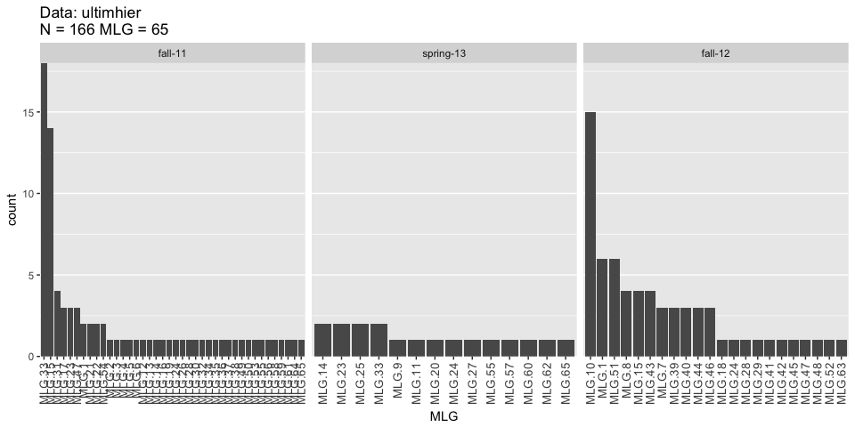
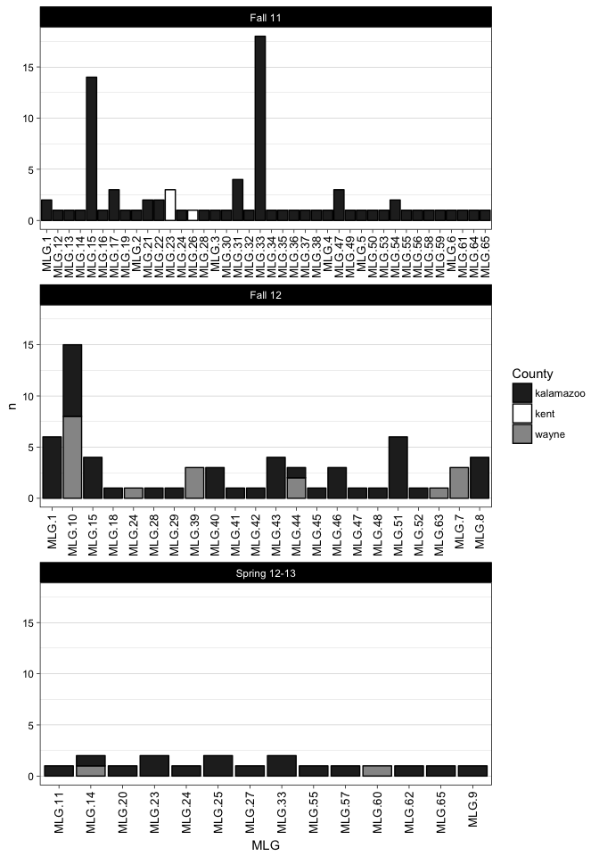

##Data input


```r
#Reading genealex object
ultimhier <- read.genalex("../data/ult_pop_clean.csv")

#recode populations

# ultimhier@pop <- dplyr::recode(ultimhier@pop, 
#                                "d_ff"="wayne_fall-12", 
#                                "d_ss"="wayne_spring-13", 
#                                "g_f"="kent_fall-11", 
#                                "k_f"="kalamazoo_fall-11", 
#                                "k_ff"="kalamazoo_fall-12",
#                                "k_ss"="kalamazoo_spring-13")

splitStrata(ultimhier, sep = "_") <- ~County/Season
```


##Genotype accumulation curve
The aim is to determine the if the SSRs are enough to describe the genotypes in the population.


```r
#Locus table
locus_table(ultimhier)
```

```
## 
## allele = Number of observed alleles
## 1-D = Simpson index
## Hexp = Nei's 1978 gene diversity
## ------------------------------------------
```

```
##       summary
## locus  allele  1-D Hexp Evenness
##   Py28   6.00 0.80 0.80     0.92
##   Py62   3.00 0.36 0.36     0.68
##   Py69   2.00 0.48 0.49     0.97
##   Py30   3.00 0.54 0.54     0.77
##   Py55   5.00 0.73 0.73     0.87
##   Py57   3.00 0.39 0.39     0.78
##   mean   3.67 0.55 0.55     0.83
```

```r
#genotype accumulation curve
gac <- genotype_curve(ultimhier, sample = 1000, quiet = TRUE, thresh = 0.9)
```

<!-- -->

##Genotype diversity
Basic summary of Pythium population data and definition of multilocus genotypes.


```r
ult_table <- poppr(ultimhier)
knitr::kable(ult_table[,-13], format="markdown", digits = 3,
             caption=" Summary statistics of P. ultimum populations")
```


|Pop                 |   N| MLG|  eMLG|    SE|     H|      G| lambda|   E.5|  Hexp|    Ia| rbarD|
|:-------------------|---:|---:|-----:|-----:|-----:|------:|------:|-----:|-----:|-----:|-----:|
|kalamazoo_fall-11   |  79|  38| 7.538| 1.302| 3.019| 10.419|  0.904| 0.484| 0.520| 1.138| 0.267|
|kent_fall-11        |   4|   2| 2.000| 0.000| 0.562|  1.600|  0.375| 0.795| 0.000|   NaN|   NaN|
|wayne_spring-13     |   2|   2| 2.000| 0.000| 0.693|  2.000|  0.500| 1.000| 0.611|    NA|    NA|
|kalamazoo_spring-13 |  16|  13| 8.875| 0.743| 2.513| 11.636|  0.914| 0.938| 0.482| 1.530| 0.326|
|wayne_fall-12       |  18|   6| 4.791| 0.774| 1.523|  3.682|  0.728| 0.748| 0.383| 3.188| 0.704|
|kalamazoo_fall-12   |  47|  18| 7.462| 1.097| 2.609| 11.213|  0.911| 0.812| 0.511| 1.284| 0.275|
|Total               | 166|  65| 8.519| 1.086| 3.629| 21.562|  0.954| 0.561| 0.550| 1.194| 0.256|

Generating a table for the multilocus genotypes across populations

```r
#Matrix indicating mulitlocus genotypes (MLGs) by population
ult.tab <- mlg.table(ultimhier)
```

<!-- -->

```r
#Associating MLGs to individual names
mlg.ult <- mlg.id(ultimhier)
#write.table(ult.tab, sep = ",", file = "data/mlg_tab.csv")
```


##Hierarchy and strata by factors

First, the strata will be recoded to facilitate interpretation of the data.  Then, the strata will be divided to generated a nested 
hierarchy.  The idea is that season is nested within county.


```r
#Accessing strata data of the genind object
ult.str <- strata(ultimhier)
knitr::kable(head(ult.str, n = 20), format = "markdown") 
```


|County    |Season  |
|:---------|:-------|
|kalamazoo |fall-11 |
|kalamazoo |fall-11 |
|kalamazoo |fall-11 |
|kalamazoo |fall-11 |
|kalamazoo |fall-11 |
|kalamazoo |fall-11 |
|kalamazoo |fall-11 |
|kalamazoo |fall-11 |
|kalamazoo |fall-11 |
|kalamazoo |fall-11 |
|kalamazoo |fall-11 |
|kalamazoo |fall-11 |
|kalamazoo |fall-11 |
|kalamazoo |fall-11 |
|kalamazoo |fall-11 |
|kalamazoo |fall-11 |
|kalamazoo |fall-11 |
|kalamazoo |fall-11 |
|kalamazoo |fall-11 |
|kalamazoo |fall-11 |

Using strata, the populations could be defined using the strata.  A hierarchy using `county/season` or just by `season` or `county`.


```r
setPop(ultimhier) <- ~County/Season
ultimhier
```

```
## 
## This is a genclone object
## -------------------------
## Genotype information:
## 
##     65 original multilocus genotypes 
##    166 diploid individuals
##      6 codominant loci
## 
## Population information:
## 
##      2 strata - County, Season
##      6 populations defined - 
## kalamazoo_fall-11, kent_fall-11, wayne_spring-13, kalamazoo_spring-13, wayne_fall-12, kalamazoo_fall-12
```

```r
setPop(ultimhier)<- ~Season
ultimhier
```

```
## 
## This is a genclone object
## -------------------------
## Genotype information:
## 
##     65 original multilocus genotypes 
##    166 diploid individuals
##      6 codominant loci
## 
## Population information:
## 
##      2 strata - County, Season
##      3 populations defined - fall-11, spring-13, fall-12
```

If the populations are defined by **county**, there are three populations.  By looking at multilocus genotypes at the county level, Kalamazoo contains most of the multilocus genotypes.


```r
#Setting up a population by county (3 populations/counties)
setPop(ultimhier) <- ~County

#Summary of multilocus genotypes by county
ult.tab <- mlg.table(ultimhier)
```

<!-- -->

```r
#write.table(poppr(ultimhier), sep = ",", file = "~/Documents/genotypebycounty.csv")
#write.table(poppr(ult.tab, sep = ",", file = "~/Documents/MLGbycounty.csv")
```

Now, if the poplation is defined by **season**, there will be three populations as well, these refer to seasons across years sampled.


```r
setPop(ultimhier)<- ~Season
ult.tab <- mlg.table(ultimhier)
```

<!-- -->

```r
#write.table(ult.tab, sep = ",", file = "~/Documents/frequencies3pop.csv")
```


```r
setPop(ultimhier) <- ~County/Season
ult.tab.strata <- mlg.table(ultimhier, plot = FALSE)

ult.mlg.table <- as.data.frame(ult.tab.strata) %>% 
  dplyr::add_rownames(var = "County") %>% 
  tidyr::gather("MLG","n",2:66) %>%
  tidyr::separate("County",c("County", "Season"), sep ="_") %>%
  #group_by(County, Season, MLG) %>% summarise(n = sum(n)) %>%
  dplyr::filter(n > 0)


ggplot(ult.mlg.table, aes(x = MLG, y = n)) + 
  geom_bar(aes(fill = County), stat = "identity", color = "black") +
  scale_fill_grey(start=0.6, end=0.2) +
  theme_linedraw() + xlab("MLG") +
  theme(panel.grid.major.x = element_blank(), 
          panel.grid.minor.x = element_blank(),
          axis.text.x = element_text(size = 10, angle = 90, 
                                     hjust = 1, vjust = 0.5)) +
   facet_wrap(~Season, scales = "free_x", shrink = TRUE, 
              drop = TRUE, ncol = 1,
              labeller = labeller(Season = c(`fall-11`="Fall 11", `fall-12`="Fall 12", `spring-13`="Spring 12-13")))
```

<!-- -->

```r
#write.table(ult.mlg.table, sep = ",", file = "data/mlg_tab.csv")
```

### Shared MLG by Season


```r
mlg.crosspop(ultimhier, strata = ~Season)
```

```
## MLG.1: (8 inds) fall-11 fall-12
## MLG.14: (3 inds) fall-11 spring-13
## MLG.15: (18 inds) fall-11 fall-12
## MLG.23: (5 inds) fall-11 spring-13
## MLG.24: (3 inds) fall-11 spring-13 fall-12
## MLG.28: (2 inds) fall-11 fall-12
## MLG.33: (20 inds) fall-11 spring-13
## MLG.47: (4 inds) fall-11 fall-12
## MLG.55: (2 inds) fall-11 spring-13
## MLG.65: (2 inds) fall-11 spring-13
```

```
## $MLG.1
## fall-11 fall-12 
##       2       6 
## 
## $MLG.14
##   fall-11 spring-13 
##         1         2 
## 
## $MLG.15
## fall-11 fall-12 
##      14       4 
## 
## $MLG.23
##   fall-11 spring-13 
##         3         2 
## 
## $MLG.24
##   fall-11 spring-13   fall-12 
##         1         1         1 
## 
## $MLG.28
## fall-11 fall-12 
##       1       1 
## 
## $MLG.33
##   fall-11 spring-13 
##        18         2 
## 
## $MLG.47
## fall-11 fall-12 
##       3       1 
## 
## $MLG.55
##   fall-11 spring-13 
##         1         1 
## 
## $MLG.65
##   fall-11 spring-13 
##         1         1
```

### Shared MLG by County


```r
mlg.crosspop(ultimhier, strata = ~County)
```

```
## MLG.10: (15 inds) kalamazoo wayne
## MLG.14: (3 inds) kalamazoo wayne
## MLG.23: (5 inds) kalamazoo kent
## MLG.24: (3 inds) kalamazoo wayne
## MLG.44: (3 inds) kalamazoo wayne
```

```
## $MLG.10
## kalamazoo     wayne 
##         7         8 
## 
## $MLG.14
## kalamazoo     wayne 
##         2         1 
## 
## $MLG.23
## kalamazoo      kent 
##         2         3 
## 
## $MLG.24
## kalamazoo     wayne 
##         2         1 
## 
## $MLG.44
## kalamazoo     wayne 
##         1         2
```


