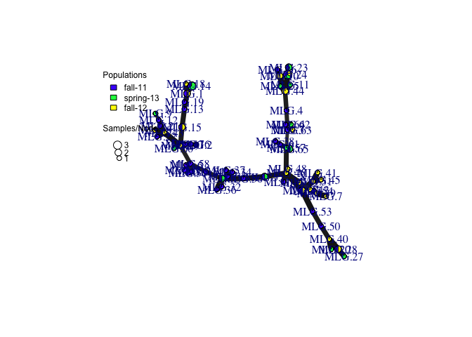

MSN by Season

______________


```r
#Repeat length
ssr.reps <- c(3, 3, 6, 6, 2, 3)

#MSN by season
setPop(ult.cc) <- ~Season
season.msn <- bruvo.msn(ult.cc, replen = ssr.reps, showplot = TRUE)
```

<!-- -->


Correcting the figure for presentation:


```r
#MSN by season
setPop(ultimhier) <- ~Season
season.msn <- bruvo.msn(ultimhier, 
                        replen = ssr.reps,
                        vertex.label.dist=0.4,
                        showplot = FALSE)
season.colors <- c("#4daf4a", "#984ea3", "#ff7f00")

#MSN
set.seed(9001)
plot_poppr_msn(ultimhier,
               season.msn,
               inds = "ALL",
               mlg = TRUE,
               gadj = 3,
               nodescale = 40,
               palette = season.colors,
               cutoff = NULL,
               quantiles = FALSE,
               beforecut = TRUE,
               pop.leg = TRUE,
               size.leg = TRUE,
               scale.leg = TRUE,
               layfun = igraph::layout_nicely)
```


MSN by County

_____________


```r
#MSN by county
setPop(ultimhier) <- ~County
county.msn <- bruvo.msn(ultimhier, replen = ssr.reps, showplot = FALSE)

#Poppr MSN
set.seed(9001)
county.colors <- c("#636363", "#bdbdbd", "#f0f0f0")
plot_poppr_msn(ultimhier, county.msn,
               inds = "none",
               mlg = TRUE,
               gadj = 3,
               nodescale = 48,
               palette = county.colors,
               cutoff = NULL,
               quantiles = FALSE,
               beforecut = TRUE,
               pop.leg = TRUE,
               size.leg = FALSE,
               scale.leg = TRUE,
               layfun = igraph::layout_nicely)
```


